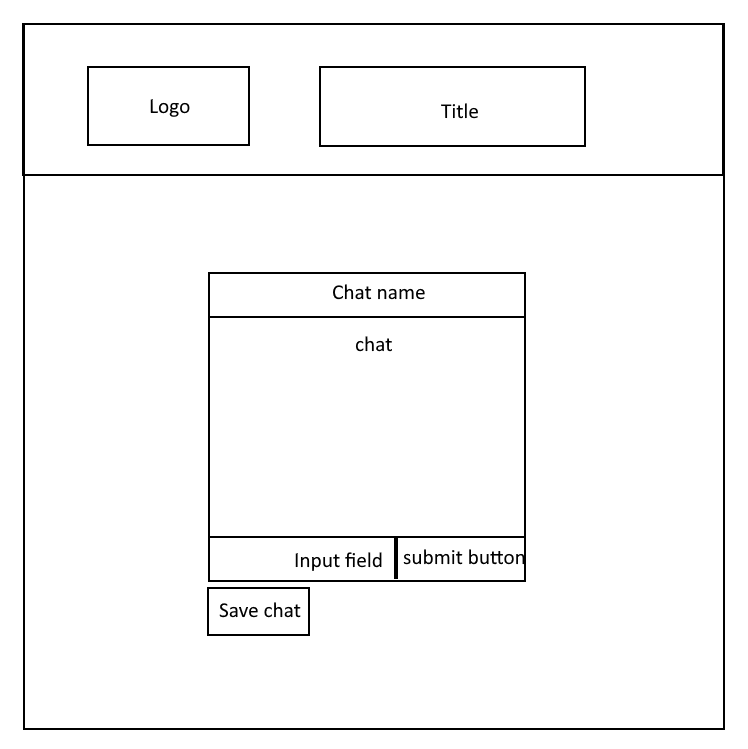
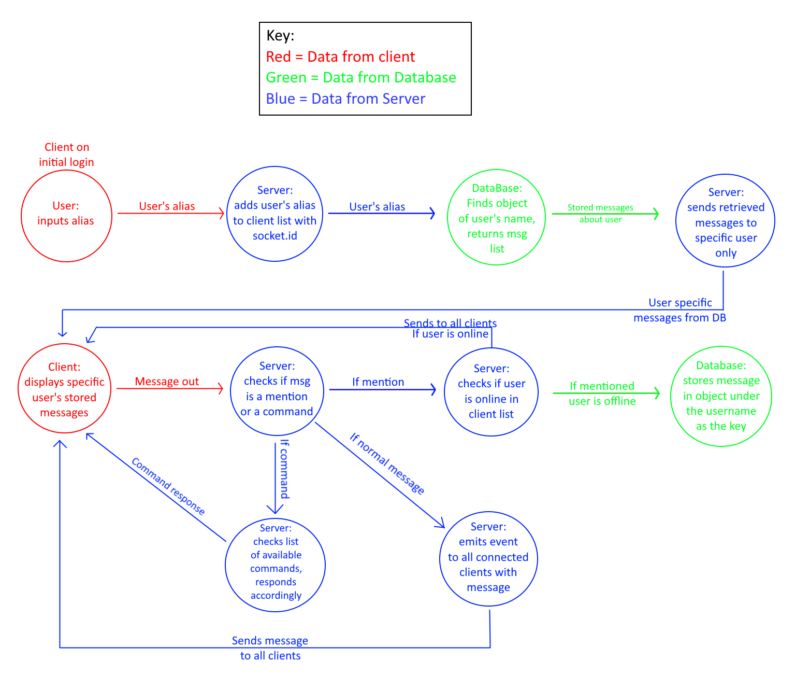
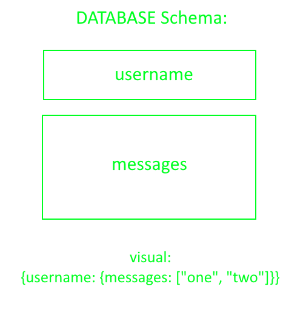

# AnonyMessage
Backend for AnonyMessage app

## Overview
- AnonyMessage app allows users to talk to each other anonymously in a chat room. This can help with loneliness and be therapeutic to the user. Also, assure the anonymity of the user.

## [Team Besh](https://github.com/BESH-401)
- [Keian Anthony](https://github.com/Keian-A)
- [Tek Jones](https://github.com/Tekthree)
- [Alexander Williams](https://github.com/SpaceLobster2311)
- [Louis Lassegue](https://github.com/mrloulass)

## Wireframe

## Domain Model

## NoSQL DB

## Technologies
- [Netlify](https://docs.netlify.com/?_ga=2.207155094.468485586.1626298259-1438724036.1626298259): deploy frontend
- [Heroku](https://devcenter.heroku.com/): deploy backend
- [Nodejs](https://nodejs.org/en/docs/): a JavaScript runtime built on the V8 JavaScript engine.
- [Socket.io](https://socket.io/docs/v4): allow bidirectional and event-based communication, server API
- [Socket.io-client](https://socket.io/docs/v4/client-api/): use on the frontend for client API
- [MongoDB](https://docs.atlas.mongodb.com/getting-started/): host and manage your data in the cloud
- [Mongoosejs](https://mongoosejs.com/docs/guide.html): schema-based solution to model your application data
- [Jestjs](https://jestjs.io/docs/getting-started): testing app connections and functionality
- [dotenv](https://www.npmjs.com/package/dotenv): hiding environment variables

## Requirements
- Setup
  1. download Nodejs and MongoDB atlas
  2. fork repository from [github](https://github.com/BESH-401/anonymessage-backend)
  3. copy repository
  4. command line on local machine `git clone` (copy repository)
  5. update all dependencies `npm update`
  6. add an .env file
  7. add your environment variables
    - `PORT`=(your local port)
    - `MONGODB_URI`=(your mongoDB cluster link)
    - Test setup with mockClient.js
      - `BASE_URL`=(your local host link)
      - `EXTENSION`=(your extension name)

## User Stories:
- As a user I want to converse anonymously
- As a user I want to be able to save conversations for later recollection
- As a user I want to receive chats regarding me when I come back online
- As a user I want to be able to learn more about strangers
- As a user I want to be able to send a message to a specific person, and have them receive it even of they are offline

## Feature tasks:
- We will implement a chat system without requiring any personal information from the user
- We will implement a "save chat" button to save the recent messages for later recollection
- There will be a queue on the server, which will send a user any messages that mention them if they come back online

## Stretch goals:
  - Authentication
  - Gifs
  - Bot (help commands)

## Acceptance tests:
AnonyMessage backend app tests
  - Initial login found on server
  - Testing message out from client to server
  - Testing message from server to client
  - Testing commands `/help`, `/commands`, `/people`
  - Message mentioning other user that is offline enters database
  - Message mentioning other user that is online remains off database

## Links
- [AnonyMessage App](https://anony-message.netlify.app/)
- [AnonyMessage backend code](https://github.com/BESH-401/anonymessage-backend)
- [AnonyMessage frontend code](https://github.com/BESH-401/anonymessage-frontend)

