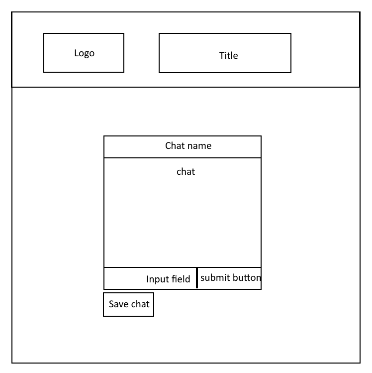

# AnonyMessage
Backend for AnonyMessage app

## Wireframe

## User Stories:
- As a user I want to converse anonymously
- As a user I want to be able to save conversations for later recollection
- As a user I want to receive chats regarding me when I come back online
- As a user I want to be able to learn more about strangers
- As a user I want to be able to send a message to a specific person, and have them receive it even of they are offline

## Feature tasks:
- We will implement a chat system without requiring any personal information from the user
- We will implement a "save chat" button to save the recent messages for later recollection
- There will be a queue on the server, which will send a user any messages that mention them if they come back online

## Acceptance tests:
- The user should be able to enter the chat without submitting any information, and send and receive information
- If the "save chat" button is clicked, there should be a response of some data
- If a user logs in under the same name, chat logs that include their username will be sent to them (that occured while they were offline)

## Domain Model
- This can be seen [here](https://louis640638.invisionapp.com/freehand/Anony-Message-Backend-Oa2xHOGMd)

## NoSQL DB
- This can be seen [here](https://louis640638.invisionapp.com/freehand/Anony-Message-Backend-Oa2xHOGMd)
